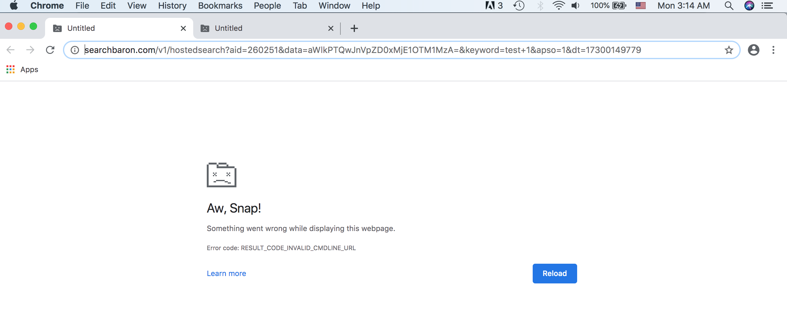

# fix_chrome_redirect_virus

## Problem description
Open a new tab on Google Chrome, enter search content on the URL text field, and press enter. I could occasionally see that Google search result shows up but it was always automatically redirected to either Yahoo or Bing. It annoys me so much. And as a man playing with circuits and codes, I decided to fix it.

#### Enter search content

#### Redirected to Bing

#### Redirected to Yahoo

### What did not fix it

#### 1. Did not find unwanted application in ~/Application (I am using a Mac).
#### 2. Chrome `settings >> Restore settings to their original defaults` did not fix it.

---

## What I did that makes a difference

### 1. `rm -rf "~/Library/Application Support/Google"`
After I did the command above as suggested online [here](https://crunchify.com/how-to-purge-all-your-google-chrome-user-data-on-mac-os-x/), and when I do a new tab search again, I got:

Now we get something interesting, since we know the trick the hijack is playing. Below are several search redirect URL: 
1. http://www.searchbaron.com/v1/hostedsearch?aid=260251&data=aWlkPTQwJnVpZD0xMjE1OTM1MzA=&keyword=test+1&apso=1&dt=17300149779
2. http://www.searchbaron.com/v1/hostedsearch?aid=260251&data=aWlkPTQwJnVpZD0xMjE1OTM1MzA=&keyword=secondtest&apso=1&dt=17300149779
3. http://www.searchbaron.com/v1/hostedsearch?aid=260251&data=aWlkPTQwJnVpZD0xMjE1OTM1MzA=&keyword=a+third+test+3&apso=1&dt=17300149779

I am so regret that I deleted the folder directly, it would be so much more fun checking what files it contains. Now I have to do some reverse engineering... which is also a lot of fun.. a different type lol~ However, after several more trys of new tab search, it installed a new `~/Library/Application Support/Google/Chrome`. A smart hijack, I almost love it lol. And now every new tab search goes to `https://www.ask.com/web?q=${search_content}`.

Nice, now let's have a look at the folder. I have copied the whole folder to `files/Chrome`. I tried searching "ask.com" inside that folder, and I did get several entries but nothing special. Thus I guess the hijack is simply using the folder, but the folder is not a part of the hijack.
